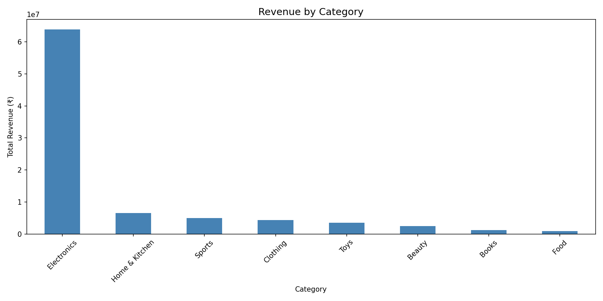
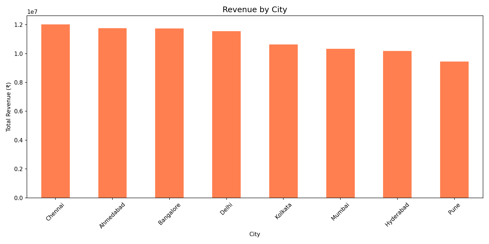
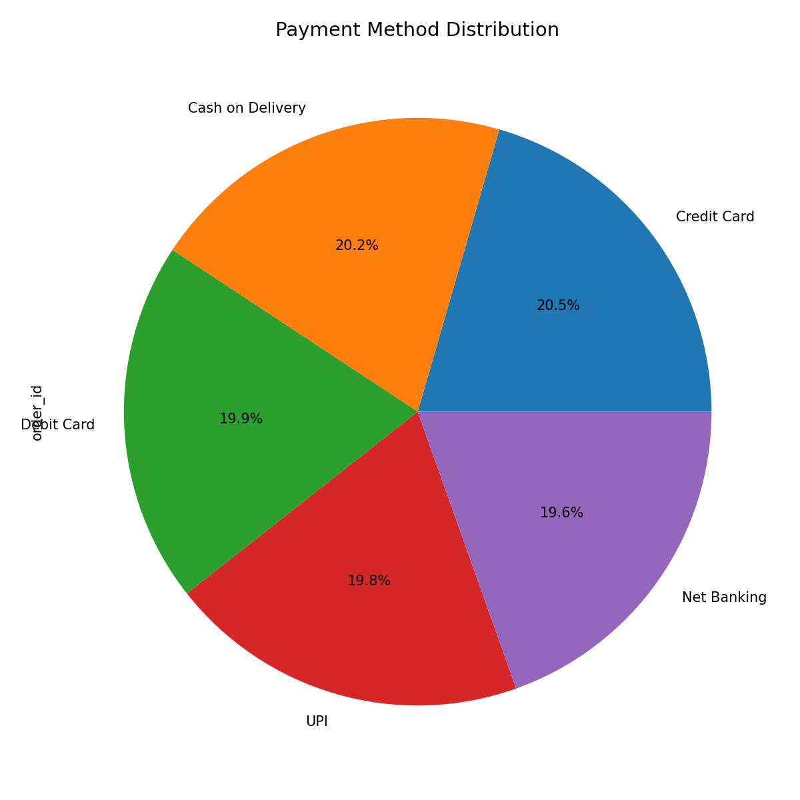

# E-Commerce Sales Analysis

Analyzing 5,000 e-commerce orders across Indian cities using Python, SQL and MySQL.

## 📊 Project Overview
Performed end-to-end sales analysis on an Indian e-commerce dataset to uncover revenue trends, top performing categories, city-wise performance and payment preferences.

## 🔍 Key Findings
- Electronics dominates revenue — far ahead of all other categories
- Mumbai leads in city-wise sales
- Credit Card is the most preferred payment method (20.5%)
- 5,000 orders analyzed across 8 major Indian cities

## 🛠️ Tools & Technologies
- Python
- Pandas
- Matplotlib
- MySQL & MySQL Workbench
- Google Colab

## 📈 Visualizations

### Revenue by Category

### Revenue by City

### Payment Method Distribution

## 🚀 How to Run
1. Clone this repository
2. Install requirements: `pip install pandas matplotlib openpyxl`
3.
